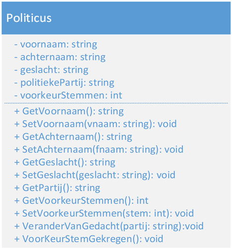

# Politicus

## Algemeen

Het doel van deze opdracht is het ontwerpen van heb businessmodel en een aangepaste UI voor het aanmaken van een politicus.

## Functionele omschrijving

Het businessmodel **Politicus** heeft de volgende eigenschappen en methoden.

1. Een naam, voornaam en geslacht.

2. Het bijhouden van de politieke partij waarvan hij/zij lid van is. Deze kan van buitenaf niet via de property veranderd worden! (Tip: private setter).

3. Bijhouden van het het aantal voorkeurstemmen.

4. Methode “VoorkeurstemGekregen/0”, die er exact 1 voorkeurstem bij telt.

5. Geef de methode “VeranderVanGedacht/1”, die:

    5.1.1. Als argument de naam van de nieuwe partij krijgt

    5.1.2. Het aantal voorkeurstemmen terugbrengt naar 0

### UML schema

[Politicus UML-scheme](/Assets/Politicus-uml.png "UML")

## Opdracht

1. Vertaal het UML schema naar een correcte klasse en in het correcte  project type.

2. Ontwerp een zo gebruikersvriendelijke interface.

3. Het geslacht van de politicus wordt bepaald aan de hand van: *Man*, *Vrouw* of *Onbepaald* welke de standaard waarde is.

4. Maak een politicus aan met 10 voorkeurstemmen.

5. Kies de meest geschikte besturingselementen (controls) voor de verschillende gegevens.

6. Zorg dat het formulier alleen maar correcte informatie aanvaard.

7. De aangemaakte politiekers moeten met hun naam en de partij aan een keuzelijst worden toegevoegd.

8. Roep de methode “VeranderVanGedacht” aan. Deze zal de politicus doen veranderen van partij.

9. Zorg voor een knop om het venster te sluiten en zo de applicatie te beëindigen.